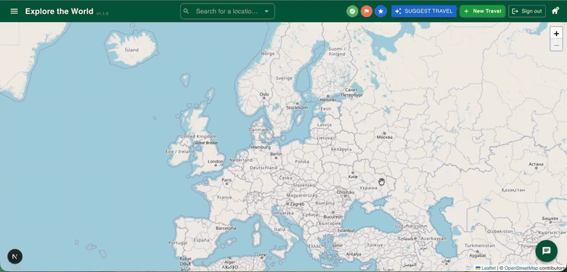
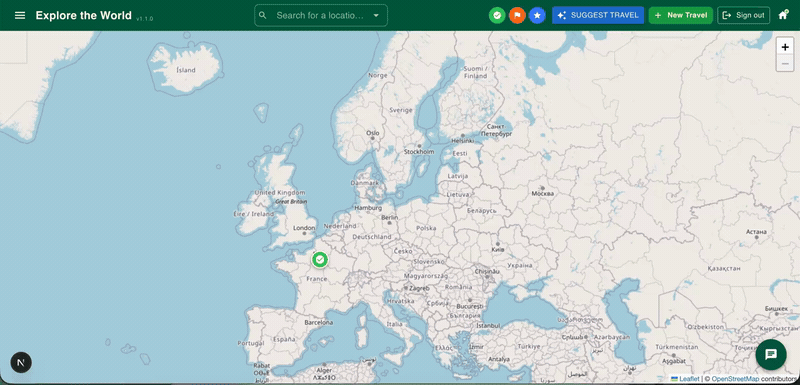
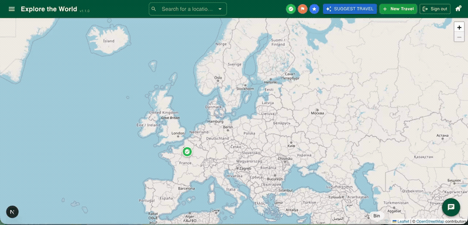

# Lets-travel-folio

## Overview

Lets Travel is a personal project for planning and organizing my own trips with a lower carbon footprint. An interactive map makes it easy to visualize destinations, map out routes, and choose greener travel options, with an AI assistant on hand to suggest more sustainable ways to explore.

## Features

- Interactive map with destination markers and search functionality

- AI-powered travel assistant for planning and suggesting sustainable travel options

- Carbon profile configuration to get personalized recommendations for eco-friendly travels

- User authentication and account management (Secured by Clerk)
- Internationalization (English & French)
- Persistent storage of travel plans

## Tech Stack

- **Framework:** [Next.js 16](https://nextjs.org) (App Router) & [React 19](https://react.dev)
- **Language:** TypeScript
- **UI:** [MUI](https://mui.com) + [Tailwind CSS](https://tailwindcss.com)
- **Maps:** [Leaflet](https://leafletjs.com) via `react-leaflet` with marker clustering
- **Authentication:** [Clerk](https://clerk.com)
- **Database:** PostgreSQL with [Prisma ORM](https://www.prisma.io)
- **State management:** [Redux Toolkit](https://redux-toolkit.js.org)
- **AI:** [Vercel AI SDK](https://sdk.vercel.ai) with Google (Gemini) models
- **i18n:** [next-intl](https://next-intl.dev)
- **Validation:** [Zod](https://zod.dev)
- **Dependency injection:** [InversifyJS](https://inversify.io)
- **Testing:** [Jest](https://jestjs.io) (unit) & [Playwright](https://playwright.dev) (e2e)
- **Deployment:** Docker & Docker Compose
- **Architecture:** Clean Architecture principles with layered structure (Presentation, Application, Domain, Infrastructure)

## Live Demo

Application URL: https://lts.badrai.fr

Please [contact me](https://badrai.fr/) for a demo account to explore the application.